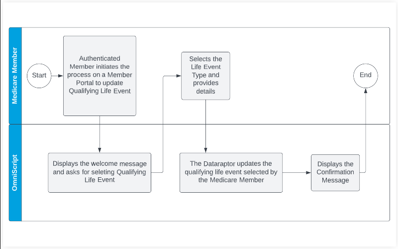

<h1>A-HLS Medicare Qualifying Life Events Add Workflow Documentation</h1>

A guided process flow for adding Medicare Qualifying Life Event.

<h2>Overview</h2>

Qualifying Life Event is a major event that affects a person’s health insurance needs and allows that person to make changes or buy a health plan immediately outside of open enrollment dates. The Special Enrollment Period lasts for 60 days before or after the qualifying event takes place and allows an individual to immediately make plan changes or sign up for new coverage.

This process allows a Medicare member to add his/her qualifying life event information with the health plan and go for a change in the existing coverages. The process with a few customizations can also be re-used as a child process under a Medicare Enrollment process where a user based on the Qualifying Life Event initiates to purchase health insurance coverage. 

<h2>Use Case Scenarios</h2>

1. An existing Medicare Member going for policy coverage/benefits change out of the OEP (Open Enrollment Period) due to a qualifying life event. 

1. A new customer buying a policy coverage/benefits out of the OEP due to a qualifying life event. (Minor customization in the process will make the process fit for this use case)

<h2>Business Objective</h2>

The business objective of this process is to allow Medicare members to update their qualifying life events information with the health plan so that they can either buy a new plan or modify the existing coverages. 

<h3>Business Value and Benefits</h3>

Enables users to add qualifying life events without needing to call or email their Health Plan. 

<h2>Industry Focus and Workflow</h2>

Primary Industry:

* Healthcare

<h3>Primary User Persona:</h3>

* Existing Medicare Member
* New Medicare Member

<h3>User Workflow:</h3>

* As an existing Medicare Member, I need a process to update my qualifying life event so that I can go change/modification in my existing coverages. 
* As a new Medicare Member, I need a process to update my qualifying life event so that I can sign up for new coverage.

<h2>Package Includes:</h2>

*OmniScript (1)*

* VPL-LifeEvent-107

*DataRaptor (2)*

* GetPersonAccountDetails
* CreateLifeEvent

<h2>Configuration Requirements</h2>

<h3>Install the Data Pack</h3>

1. The Data Pack folder in the following GitHub repository contains one (1) DPA Data Pack. Please download the Data Pack and save them to your desktop: https://github.com/healthcare-and-life-sciences/Medicare-Qualifying-Life-Events-Add-Workflow
2. Then, complete the following steps to import them into your Salesforce org.
    1. To Import, in your destination Salesforce org, Click on *App Launcher* → Search for '*OmniStudio DataPacks*' and click on it.
    2. Click on '*Installed*' and on the right side click on '*Import from*'.
    3. Select '*From File*' - When the window opens, select the Data Pack file that you downloaded and stored on your machine. Click '*Install*'.
3. More about DataRaptors: https://trailhead.salesforce.com/content/learn/modules/omnistudio-dataraptors

<h3>Post-Install Configuration Steps:</h3>

1. Make sure Person Accounts are enabled in the org.
2. Grant users access to view their Person Account page.
3. Activate the OmniScript LWC that you imported with the Data Pack above. Please refer to the following help article for more information on how to activate a FlexCard: https://docs.vlocity.com/en/Activate-a-FlexCard.html.
4. Add the OmniScript LWC to the Person Account Lightning Page. For more information on how to add Lightning Web Components to a page, please refer to this help article: https://docs.vlocity.com/en/Add-a-FlexCard-to-a-Lightning-Page.html.

<h2>Assumptions</h2>

1. The org that the process has been installed in has Person Accounts enabled.
2. This process works in the context of a Person Account Id.
3. The user is using Salesforce Lightning Experience — not Classic.

<h2>Revision History</h2>

* *Revision Short Description (July 5, 2022)*
    * Changed all fields to required

